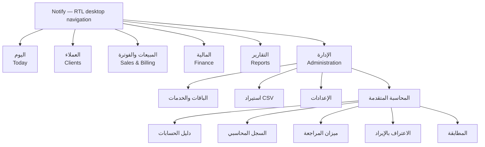
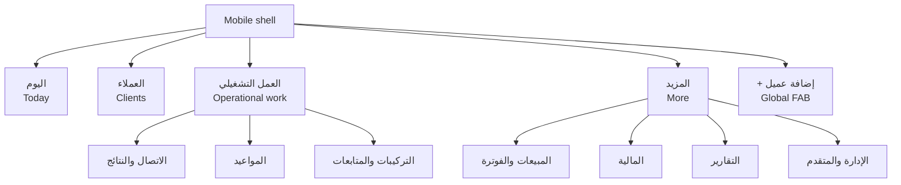
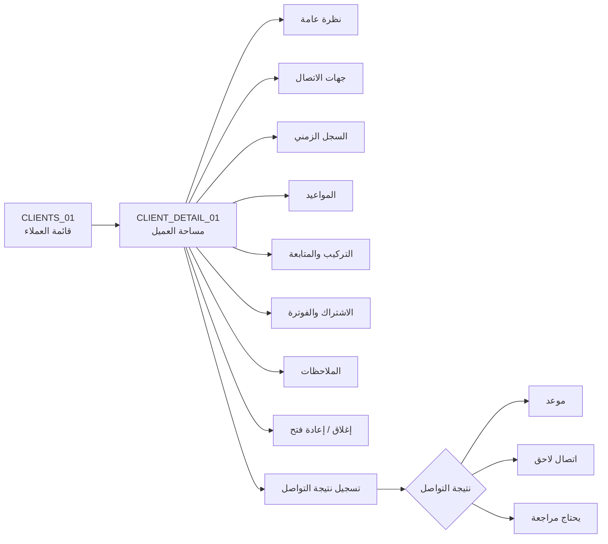
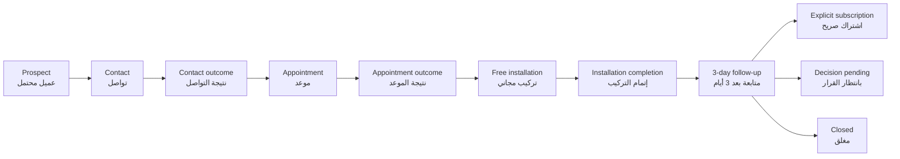
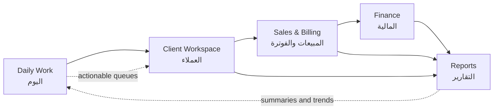

# Notify — D1 Information Architecture

## D1 status

**Status:** Complete. This phase defines one recommended information architecture for Notify. It does not define final visual styling, high-fidelity screens, frontend code, or backend behavior.

The architecture follows the locked product facts from `NOTIFY_DESIGN_SOURCE_V1` and the approved D0 report. It is optimized for a two-person company that performs operational work every day, while preserving clear expansion points for additional employees and deeper administration later.

## Architecture strategy

Notify should be organized around **what the user needs to do**, not around the underlying database or every stored entity. The primary structure is:

1. **اليوم — Today:** action queues and concise business snapshots.
2. **العملاء — Clients:** the client directory and complete client workspace.
3. **المبيعات والفوترة — Sales & Billing:** subscriptions, renewals, invoices, collections, and customer credit.
4. **المالية — Finance:** daily financial operations and management finance reports.
5. **التقارير — Reports:** Executive, SaaS, and Finance reporting with distinct purposes.
6. **الإدارة — Administration:** commercial catalog, CSV import, settings, and other infrequent administration.
7. **المحاسبة المتقدمة — Advanced Accounting:** a secondary admin-oriented area reached from Administration or a clearly separated advanced section.

The first five areas form the normal working model. Administration and Advanced Accounting remain accessible but do not compete with daily work. The global floating action is locked as **+ إضافة عميل** and is available across the product. Appointment, expense, payment, and finance actions are contextual or surfaced on Today; they are not global FAB actions.

The default information model has three levels:

| Level | Purpose | Typical content |
|---|---|---|
| Default view | Support the current decision or action | Due time, stage, next action, amount, status, owner |
| Detail view | Provide complete business context | Timeline, contacts, notes, history, related records |
| Advanced view | Expose technical, accounting, or configuration detail deliberately | Price history, internal codes, journal detail, reconciliation |

## 1. Product hierarchy

| Area | Purpose | Audience | Frequency | Contained screens or contexts | Primary navigation? |
|---|---|---|---|---|---|
| **Today / اليوم** | Answer “ماذا يجب أن أفعل الآن؟” and collect the day’s actionable work | Admin and staff | Every working session | Action queues, urgent work, new prospects, concise activity and business snapshots | **Yes** |
| **Clients / العملاء** | Manage businesses, contacts, lifecycle stages, history, and next actions | Admin and staff | Very frequent | Client list, client workspace, contact outcome, timeline, notes, related operational records | **Yes** |
| **Sales & Billing / المبيعات والفوترة** | Manage explicit subscriptions, renewals, invoices, collections, and customer credit | Admin primarily; staff sees operationally relevant context | Frequent for admin; contextual for staff | Subscription list/detail, start subscription, renewals queue, invoices/collections, customer credit | **Yes** |
| **Finance / المالية** | Run daily finance and inspect management financial reports | Admin | Daily or periodic | Expenses, financial accounts/cash, transfers, assets, management finance reports | **Yes** |
| **Reports / التقارير** | Separate company health, SaaS growth, and management finance reporting | Admin/founder | Periodic review | Executive, SaaS, and Finance report views | **Yes, secondary position** |
| **Administration / الإدارة** | Maintain catalog, import data, and configure the product | Admin | Infrequent or as needed | Packages/services, CSV import, settings | **Secondary** |
| **Advanced Accounting / المحاسبة المتقدمة** | Provide technical accounting operations without dominating normal navigation | Admin | Infrequent or specialist work | Chart of Accounts, Journal, Trial Balance, Revenue Recognition, Reconciliation | **No; secondary/advanced access** |

## 2. Desktop navigation

### Recommended persistent RTL sidebar



### Primary navigation

1. **اليوم** — the default landing area and operational command center.
2. **العملاء** — the durable business relationship workspace.
3. **المبيعات والفوترة** — explicit subscription and customer-money workflows.
4. **المالية** — daily finance operations.
5. **التقارير** — Executive, SaaS, and Finance reporting.

### Secondary navigation

- **الإدارة** contains Packages & Services, CSV Import, and Settings.
- **المحاسبة المتقدمة** is nested under Administration or exposed as a clearly marked advanced destination for admin users.
- Renewals, callbacks, trial follow-ups, decision-pending work, and client reviews are queues or filters, not separate permanent sidebar destinations.

### Utility items

- Global **+ إضافة عميل** action.
- User/session utility.
- Notifications or reminders when available through the product’s supported behavior.
- Language/direction readiness for Arabic-first RTL and future English LTR.
- Search or global client lookup may be added as a utility only if supported by the product; it must not become an invented workflow.

### Admin-only visibility

Admin is the intended audience for Finance, Reports, Administration, and Advanced Accounting. Staff navigation should focus on Today, Clients, and operational client work. D1 does not define detailed RBAC or field-level permissions.

### Intentionally excluded from the sidebar

The following are intentionally not permanent top-level destinations: callbacks, trial follow-ups, decision pending, client reviews, appointments today, installations today, overdue collections, price history, customer credit as a standalone daily page, and individual contact outcomes. They are accessed through Today, Client Workspace, Sales & Billing, or deliberate detail/advanced views.

## 3. Mobile navigation

Mobile is not a compressed desktop sidebar. It is a one-hand operational surface.



### Primary mobile destinations

- **اليوم:** due work grouped by action and time.
- **العملاء:** touch-friendly client cards and search/filter access.
- **العمل التشغيلي:** calls/outcomes, appointments, installations, and follow-ups.
- **المزيد:** less frequent Sales & Billing, Finance, Reports, Administration, and Advanced access.
- **Global FAB:** fixed **+ إضافة عميل**.

The mobile shell may expose operational work as a compact destination or as Today filters, but it must preserve direct access to calls, outcomes, appointments, installations, and follow-ups. Less frequent finance and administration functions are reached through **المزيد** and are not given equal bottom-navigation prominence.

## 4. Daily Home architecture

The home page is a prioritized work queue, not an analytics dashboard. Its primary question is:

> **ماذا يجب أن أفعل الآن؟**

### Primary action groups

1. **الآن / Today:** callbacks due, appointments today, and installations today.
2. **متابعة مطلوبة / Follow-up required:** trial follow-ups, decision pending, and client reviews.
3. **مال يجب متابعته / Money requiring attention:** renewals due and overdue collections.
4. **جديد / New:** new prospects.

Each group should show a count, urgency or due time, and a direct action. A user should be able to open the relevant client or record without navigating through a generic report first.

### Secondary information

- Recent activity summary.
- Subscription snapshot.
- Collection snapshot.
- Cash snapshot.

These are compact supporting summaries. They do not compete visually with the action groups and do not become a wall of equal KPI cards.

### Home quick actions

- Global: **+ إضافة عميل**.
- Contextual or Home-level: **+ موعد** and **+ مصروف**.
- Collection/payment actions may appear in the collections context or as a due-work action; they are not global FAB actions.

### Excluded from Home

Advanced accounting, full price history, raw journal details, allocation-engine details, complete financial tables, technical identifiers, and broad report catalogs are excluded from the default Home view.

## 5. Client architecture

The Client Workspace is the main context for one business. It should make the business’s current state and next action visible before showing its complete history.



### Global screen

**CLIENTS_01 — العملاء / Clients** is the global client list. Desktop uses an efficient table/card hybrid. Mobile uses large actionable cards.

The default client item emphasizes business name, business type, primary phone, stage, next action, responsible user, last activity, and due time. Quick actions are call, WhatsApp, record outcome, appointment, and open client.

### Workspace sections

**CLIENT_DETAIL_01 — مساحة العميل / Client Workspace** contains:

- **نظرة عامة / Overview:** business identity, current lifecycle stage, next action, responsible user, due time, and primary contextual action.
- **جهات الاتصال / Contacts:** contact records and contact methods.
- **السجل الزمني / Timeline:** chronological activity and preserved history.
- **المواعيد / Appointments:** related appointments and outcomes.
- **التركيب والمتابعة / Installation & Follow-up:** installation status, completion, and three-day follow-up context.
- **الاشتراك والفوترة / Subscription & Billing:** subscription summary, invoice status, payment/collection context, and renewal context without accounting internals.
- **الملاحظات / Notes:** business notes.

### Action placement

| Action | Placement | Reason |
|---|---|---|
| Call | Inline action in list and workspace header | High-frequency mobile action |
| WhatsApp | Inline action in list and workspace header | High-frequency mobile action |
| Record contact outcome | Inline action or focused drawer/modal from client context | Outcome must be fast and contextual |
| Create appointment | Contextual action from outcome, client workspace, or Today | Appointment is related to a client and is not a global FAB |
| Schedule installation | Workspace section/action after appointment context | Installation belongs to the client journey |
| Complete installation | Workspace action and Today queue action | Completion creates follow-up but not subscription |
| Create/review follow-up | Workspace section and Today queue | Follow-up is operational work, not a separate domain page |
| Start subscription | Full focused flow from Billing section or Sales & Billing | Requires package, interval, exact price, options, and explicit start |
| Close/reopen | Workspace action with appropriate state confirmation | Client history remains preserved |
| Notes | Inline add/edit within Notes section | Keeps routine context local |
| Advanced accounting detail | Deliberate detail link only | Must not pollute operational client view |

### Queues

- **Active contact queue:** clients needing contact.
- **Callbacks due:** due callback date/time.
- **Appointments today:** today’s appointments.
- **Installations today:** today’s installations.
- **Trial follow-ups due:** default three-day follow-up work.
- **Decision pending:** clients awaiting a decision.
- **Client reviews pending:** records requiring review.

These queues can be represented as Today groups, client-list filters, and workspace-related views. They do not need independent primary pages.

## 6. Primary operational journey



| Step | Screen/context | Primary action | Next destination |
|---|---|---|---|
| Prospect | Today new-prospect queue or Clients list | Open the client and begin contact | Client Workspace / contact action |
| Contact | Client Workspace header or contact context | Call, WhatsApp, or attempt contact | Contact outcome capture |
| Contact Outcome | Focused outcome drawer/modal in client context | Select one supported outcome and supply required date/time or note | Appointment, callback queue, active queue, review queue, or client remains active |
| Appointment | Client Workspace Appointments section or Today appointment action | Schedule/review appointment | Appointment outcome context |
| Appointment Outcome | Appointment detail/action in client context | Record the supported operational result and continue the journey | Free Installation context or relevant follow-up/review state |
| Free Installation | Installation & Follow-up section | Schedule the free installation | Today installations queue / installation context |
| Installation Completion | Installation action from Today or Client Workspace | Record completion | Installed Free state plus default three-day follow-up |
| 3-Day Follow-up | Today trial-follow-up queue or workspace section | Contact client and record result | Explicit subscription, Decision Pending, or Closed |
| Subscribe | Focused Start Subscription flow | Select package, interval, exact price, relevant options, then explicitly start | Subscription Detail and client Billing section |
| Decision Pending | Today queue and client workspace | Set or perform the next decision follow-up | Remains Decision Pending until an explicit outcome |
| Closed | Client Workspace state | Preserve history; explicitly reopen only when intended | Closed history or active client workflow after explicit reopen |

The architecture does not create a new lifecycle stage for appointment outcome. Appointment outcome is an operational record/action that leads to the existing supported lifecycle context.

## 7. Sales and billing architecture

Sales & Billing is one domain with separate focused workspaces rather than a flat collection of technical pages.

| Context | Architecture treatment | Default information |
|---|---|---|
| Subscriptions | Global list/queue under Sales & Billing | Client, package, status, interval, current period, next renewal, invoice status |
| Start Subscription | Focused multi-step flow from a client or Sales & Billing | Package, billing interval, exact price, relevant branches/options, explicit start |
| Subscription Detail | Detail screen or workspace section | Package, status, interval, current period, next renewal, invoice status, lifecycle actions |
| Renewals | Operational queue/filter | Renewals due, client, due timing, status, next action |
| Invoices | Billing context and focused list/detail | Invoice status and relevant client/subscription context |
| Collections | Operational money queue and focused record action | Who owes money, amount, account, payment method, optional reference |
| Customer Credit | Billing detail or filtered Sales & Billing view | Customer credit context without exposing allocation-engine internals |
| Commercial Catalog | Administration domain | Packages and services with status, monthly/annual price, branches, services |
| Price History | Advanced/detail view from package | Historical price versions only when deliberately opened |

Subscriptions, invoices, collections, and renewals are related but should not be collapsed into one overloaded screen. Their user goals differ: subscription management changes service state, renewals manage upcoming billing events, invoices show billing status, and collections record money received or owed.

The default experience hides allocation-engine details, accounting postings, internal codes, and price-versioning mechanics. Payment recording remains a payment/collection action and does not create a subscription.

## 8. Finance architecture

### A. Daily Finance

Daily finance should be a compact operating domain with action-oriented lists and cards.

- **Expenses:** simplified list emphasizing date, expense/title, category, payment account/source, and amount. Vendor, beneficiary, reference, personal payer, funding source, notes, and other metadata belong in detail or advanced views.
- **Financial Accounts & Cash:** account balances and cash position in a concise operational view.
- **Transfers:** contextual action within the financial-account context, not necessarily a separate primary page.
- **Assets & Funding:** one operational area for asset records and relevant funding information, with details available when needed.

### B. Management Finance

Management finance is the Finance report group and includes P&L, Cash Flow, Balance Sheet, AR Aging, Recognized Revenue, and Deferred Revenue. These are reporting views, not daily transaction-entry pages.

### C. Advanced Accounting

Advanced Accounting is secondary/admin-oriented and contains Chart of Accounts, Journal, Trial Balance, Revenue Recognition, and Reconciliation. It is reached from Administration or a clearly marked advanced area. It must not dominate daily navigation or appear inside the normal client workspace.

## 9. Reporting architecture

| Report domain | Purpose | Contents | Relationship to other reports |
|---|---|---|---|
| **Executive / Executive** | Founder/company health | MRR, recognized revenue, cash collected, cash available, expenses, net income, AR, active subscribers, renewals due | High-level company view; avoids repeating detailed SaaS or finance tables |
| **SaaS / SaaS** | Subscription growth and retention | MRR, ARR, Active Subscriptions, Active Clients, Net New MRR, New, Expansion, Contraction, Churn, Reactivation, MRR by Plan, Monthly vs Annual, Renewals Due, 12-Month Trend | Focuses on subscription movement and retention; does not duplicate the full finance report |
| **Finance / Finance** | Management financial reporting | P&L, Cash Flow, Balance Sheet, AR Aging, Recognized Revenue, Deferred Revenue | Focuses on financial statements and management finance; does not become an executive KPI wall |

Advanced metrics such as NRR, GRR, reconciliation, and canonical normalized ARR details remain available as advanced SaaS or accounting detail when supported, but are not primary navigation destinations.

## 10. Screen inventory

The following stable IDs are the recommended D1 inventory. Later phases should preserve these IDs even if visual layouts change.

| ID | Arabic name | Internal English name | Domain | Purpose | Audience | Frequency | Desktop priority | Mobile priority | Navigation parent | Related screens |
|---|---|---|---|---|---|---|---|---|---|---|
| HOME_01 | اليوم | Today Home | Today | Show prioritized work and concise snapshots | Admin, staff | Every session | High | Highest | Today | CLIENTS_01, SALES_01, FINANCE_01 |
| CLIENTS_01 | العملاء | Clients | Clients | Browse and filter businesses | Admin, staff | Very frequent | High | Highest | Clients | CLIENT_DETAIL_01, HOME_01 |
| CLIENT_DETAIL_01 | مساحة العميل | Client Workspace | Clients | Complete context for one business | Admin, staff | Very frequent | High | Highest | Clients | CLIENTS_01, APPOINTMENTS_01, INSTALL_01, SALES_01 |
| APPOINTMENTS_01 | المواعيد | Appointments | Clients / Operations | Review appointments and today’s appointment work | Admin, staff | Frequent | High | High | Today/Clients context | CLIENT_DETAIL_01, INSTALL_01 |
| INSTALL_01 | التركيبات والمتابعات | Installations & Follow-ups | Clients / Operations | Manage installations and post-install follow-up | Admin, staff | Frequent | Medium | High | Today/Clients context | CLIENT_DETAIL_01, APPOINTMENTS_01 |
| CONTACT_01 | تسجيل نتيجة التواصل | Contact Outcome | Clients / Operations | Record one supported contact result | Admin, staff | Very frequent | Medium | Highest | Client context | CLIENT_DETAIL_01, HOME_01 |
| SALES_01 | الاشتراكات والفوترة | Sales & Billing | Sales & Billing | Overview of subscriptions, renewals, invoices, and collections | Admin; staff as permitted | Frequent | High | Medium | Sales & Billing | SUBSCRIPTION_01, RENEWALS_01, COLLECTIONS_01 |
| SUBSCRIPTION_01 | الاشتراكات | Subscriptions | Sales & Billing | Browse and filter subscriptions | Admin; staff as permitted | Frequent | High | Medium | Sales & Billing | SUBSCRIPTION_START_01, SUBSCRIPTION_DETAIL_01 |
| SUBSCRIPTION_START_01 | بدء الاشتراك | Start Subscription | Sales & Billing | Explicitly start a paid subscription | Admin; staff only if permitted | Occasional | High | Medium | Sales & Billing / Client Billing | SUBSCRIPTION_DETAIL_01, CLIENT_DETAIL_01 |
| SUBSCRIPTION_DETAIL_01 | تفاصيل الاشتراك | Subscription Detail | Sales & Billing | View and manage one subscription | Admin; staff as permitted | Frequent | High | Medium | Sales & Billing | CLIENT_DETAIL_01, RENEWALS_01 |
| RENEWALS_01 | التجديدات | Renewals | Sales & Billing | Work renewals due | Admin; staff operationally as permitted | Frequent/periodic | High | Medium | Sales & Billing | SUBSCRIPTION_DETAIL_01, COLLECTIONS_01 |
| COLLECTIONS_01 | التحصيل | Collections | Sales & Billing | Review who owes money and record collection | Admin; staff as permitted | Frequent | High | High | Sales & Billing / Today | CLIENT_DETAIL_01, FINANCE_01 |
| FINANCE_01 | المالية اليومية | Daily Finance | Finance | Manage cash, accounts, expenses, transfers, and assets | Admin | Daily/periodic | High | Medium | Finance | EXPENSES_01, ACCOUNTS_01, ASSETS_01 |
| EXPENSES_01 | المصاريف | Operating Expenses | Finance | Review and record operating expenses | Admin | Frequent | High | High for quick action | Finance | FINANCE_01, ACCOUNTS_01 |
| ACCOUNTS_01 | الحسابات المالية | Financial Accounts & Cash | Finance | View financial accounts and cash position | Admin | Daily/periodic | High | Medium | Finance | FINANCE_01, COLLECTIONS_01 |
| ASSETS_01 | الأصول والتمويل | Assets & Funding | Finance | Manage assets and relevant funding context | Admin | Periodic | Medium | Low | Finance | FINANCE_01 |
| EXECUTIVE_01 | التنفيذي | Executive Report | Reports | Show founder/company health | Admin | Periodic | High | Low | Reports | SAAS_01, FINANCE_REPORTS_01 |
| SAAS_01 | مؤشرات الاشتراكات | SaaS Report | Reports | Show subscription growth and retention | Admin | Periodic | High | Low | Reports | SUBSCRIPTION_01, EXECUTIVE_01 |
| FINANCE_REPORTS_01 | التقارير المالية | Finance Reports | Reports | Show management finance reports | Admin | Periodic | High | Low | Reports | FINANCE_01, EXECUTIVE_01 |
| CATALOG_01 | الباقات والخدمات | Commercial Catalog | Administration | Manage packages and services | Admin | Infrequent | High | Low | Administration | CATALOG_DETAIL_01, SUBSCRIPTION_START_01 |
| CATALOG_DETAIL_01 | تفاصيل الباقة أو الخدمة | Catalog Item Detail | Administration | Manage one package/service; expose advanced details deliberately | Admin | Infrequent | High | Low | Administration | CATALOG_01, SUBSCRIPTION_START_01 |
| IMPORT_01 | استيراد CSV | CSV Import | Administration | Import supported client data without creating paid subscribers | Admin | Infrequent | Medium | Low | Administration | CLIENTS_01 |
| SETTINGS_01 | الإعدادات | Settings | Administration | Manage available configuration | Admin | Infrequent | Medium | Low | Administration | CATALOG_01 |
| ACCOUNTING_01 | المحاسبة المتقدمة | Advanced Accounting | Advanced Accounting | Entry point to technical accounting operations | Admin | Infrequent | High for admin | Very low | Administration / Advanced | ACCOUNTING_DETAIL_01 |
| ACCOUNTING_DETAIL_01 | تفاصيل المحاسبة | Accounting Detail | Advanced Accounting | Access Chart of Accounts, Journal, Trial Balance, Revenue Recognition, and Reconciliation | Admin | Infrequent | High for admin | Very low | Advanced Accounting | FINANCE_REPORTS_01 |

Operational queues such as callbacks, trial follow-ups, decision pending, client reviews, appointments today, installations today, renewals due, and overdue collections are represented by HOME_01 groups, filters, and related screen states rather than additional stable top-level screens.

## 11. Complexity reduction report

### Screens merged or consolidated

- Daily dashboards and operational reminder pages are consolidated into **HOME_01 Today** with grouped queues.
- Subscription overview, billing overview, and renewal visibility are coordinated under **SALES_01**, while retaining focused detail screens where user goals differ.
- Daily finance landing, cash position, and account overview are coordinated under **FINANCE_01** and **ACCOUNTS_01**.
- Assets and funding are treated as one operational Finance context instead of forcing separate top-level pages.
- Client-related appointments, installations, follow-ups, timeline, notes, and subscription summary are unified in **CLIENT_DETAIL_01**.

### Converted to workspace sections or tabs

- Contacts, Timeline, Appointments, Installation & Follow-up, Subscription & Billing, and Notes become Client Workspace sections.
- Subscription billing summary becomes a Client Workspace section while global subscription management remains in Sales & Billing.
- Customer Credit becomes a billing context/detail view rather than a permanent primary destination.
- Price History becomes a package detail/advanced view.
- Transfers become a Financial Accounts contextual action.
- Appointment outcome becomes an appointment/client action rather than a new page.

### Converted to queues

- Callbacks due.
- Trial follow-ups due.
- Decision pending.
- Client reviews pending.
- Appointments today.
- Installations today.
- Renewals due.
- Overdue collections.
- New prospects.

### Removed from primary navigation

- Callback page.
- Trial Follow-ups page.
- Decision Pending page.
- Client Reviews page.
- Appointments Today page as a standalone destination.
- Installations Today page as a standalone destination.
- Renewals Due as a standalone top-level destination.
- Customer Credit as a standalone top-level destination.
- Price History as a standalone top-level destination.
- Individual contact-outcome pages.
- Advanced Accounting pages from normal daily navigation.

The functionality remains accessible through Today, Client Workspace, Sales & Billing, Finance, Administration, or deliberate detail views.

### Moved into details or Advanced

- Vendor, beneficiary, reference, personal payer, funding source, notes, and other expense metadata move to expense detail or advanced detail.
- Allocation-engine details and accounting postings move to deliberate billing/accounting detail.
- Internal codes, technical identifiers, and historical price versions move to Catalog Item Detail or Advanced.
- Advanced SaaS metrics and canonical normalized ARR details move out of default report summaries.
- Accounting detail is excluded from the operational client workspace.

### Lists/cards instead of wide tables

- Client list uses a desktop table/card hybrid and mobile actionable cards.
- Daily queues use compact action cards or grouped lists.
- Operating Expenses use simplified desktop lists and mobile cards emphasizing date, title, category, account/source, and amount.
- Collections and Renewals use action-oriented lists with due timing and next action rather than database-complete tables.
- Financial Accounts and Assets use summary cards with detail access rather than broad mobile tables.

### Progressive-disclosure forms

- Contact Outcome shows only the selected result and required follow-up input. Date/time appears only for appointment or callback outcomes; notes are required where the source requires review or note capture.
- Start Subscription reveals package, interval, exact price, and relevant branch/options in a focused sequence. Technical price-version data is not default.
- Payment/collection recording starts with client, amount, financial account, payment method, and optional reference. Allocation and postings remain secondary.
- Expense entry starts with date, title, category, account/source, and amount. Additional metadata is revealed in detail.
- Catalog item editing separates normal package/service fields from advanced internal codes and price history.

## 12. Relationship between work domains



Daily Work is the entry point for action. Client Workspace supplies the business context. Sales & Billing manages explicit subscriptions and money-related customer work. Finance manages the company’s financial operations and management statements. Reports summarize company health, SaaS movement, and management finance without replacing operational work.

## 13. Role visibility

### Admin

Admin can access the complete product structure: Today, Clients, Sales & Billing, Finance, Reports, Administration, and Advanced Accounting. Admin is the primary audience for commercial catalog maintenance, financial accounts, expenses, assets, management reports, and accounting operations.

### Staff

Staff focuses primarily on Today, Clients, contact actions, appointments, installations, follow-ups, and the operational portions of Sales & Billing that are made available. Staff should not be burdened with advanced accounting or configuration navigation. D1 does not define detailed RBAC or imply unsupported permission behavior.

## 14. D1 decisions that are locked for later phases

- The global FAB is **+ إضافة عميل** and is not reused for expenses, appointments, payments, or finance actions.
- Today is the default action-oriented home and must answer **ماذا يجب أن أفعل الآن؟**.
- Clients is a durable primary domain, and the Client Workspace is the main context for one business.
- Callbacks, trial follow-ups, decision pending, client reviews, appointments today, installations today, renewals due, overdue collections, and new prospects are queues or filters rather than an unnecessarily long sidebar.
- Sales & Billing groups subscriptions, renewals, invoices, collections, and customer credit while preserving focused workflows.
- Daily Finance, Management Finance, and Advanced Accounting are clearly separated.
- Advanced Accounting is secondary/admin-oriented.
- Desktop navigation uses a persistent RTL hierarchy with daily domains first.
- Mobile navigation prioritizes Today, Clients, operational work, and the locked FAB; infrequent areas are under More.
- Default, detail, and advanced information levels remain distinct.
- All canonical client stages and backend rules from D0 remain unchanged.

## Final JSON report

```json
{
  "phase": "D1_INFORMATION_ARCHITECTURE",
  "status": "COMPLETE",
  "architecture_strategy": "Organize Notify around daily decisions and client context rather than backend entities. Use Today as the action command center, Clients as the durable business workspace, Sales & Billing as the explicit subscription and customer-money domain, Finance as the daily and management finance domain, Reports as distinct Executive/SaaS/Finance views, Administration as secondary configuration, and Advanced Accounting as a deliberately secondary admin area. Use progressive disclosure: default for the current action, detail for full business context, and advanced for technical/accounting/configuration detail.",
  "product_hierarchy": [
    {
      "id": "TODAY",
      "name_ar": "اليوم",
      "name_en": "Today / Daily Work",
      "purpose": "Answer ماذا يجب أن أفعل الآن؟ through prioritized operational queues and concise snapshots.",
      "audience": "Admin and staff",
      "frequency": "Every working session",
      "contained_screens": ["HOME_01"],
      "primary_navigation": true
    },
    {
      "id": "CLIENTS",
      "name_ar": "العملاء",
      "name_en": "Clients",
      "purpose": "Manage businesses, contacts, lifecycle context, history, and next actions.",
      "audience": "Admin and staff",
      "frequency": "Very frequent",
      "contained_screens": ["CLIENTS_01", "CLIENT_DETAIL_01", "CONTACT_01", "APPOINTMENTS_01", "INSTALL_01"],
      "primary_navigation": true
    },
    {
      "id": "SALES_BILLING",
      "name_ar": "المبيعات والفوترة",
      "name_en": "Sales & Billing",
      "purpose": "Manage explicit subscriptions, renewals, invoices, collections, and customer credit.",
      "audience": "Admin primarily; staff for permitted operational work",
      "frequency": "Frequent for admin",
      "contained_screens": ["SALES_01", "SUBSCRIPTION_01", "SUBSCRIPTION_START_01", "SUBSCRIPTION_DETAIL_01", "RENEWALS_01", "COLLECTIONS_01"],
      "primary_navigation": true
    },
    {
      "id": "FINANCE",
      "name_ar": "المالية",
      "name_en": "Finance",
      "purpose": "Run daily finance operations and access management finance context.",
      "audience": "Admin",
      "frequency": "Daily or periodic",
      "contained_screens": ["FINANCE_01", "EXPENSES_01", "ACCOUNTS_01", "ASSETS_01"],
      "primary_navigation": true
    },
    {
      "id": "REPORTS",
      "name_ar": "التقارير",
      "name_en": "Reports",
      "purpose": "Separate company health, SaaS growth/retention, and management financial reporting.",
      "audience": "Admin/founder",
      "frequency": "Periodic",
      "contained_screens": ["EXECUTIVE_01", "SAAS_01", "FINANCE_REPORTS_01"],
      "primary_navigation": true
    },
    {
      "id": "ADMINISTRATION",
      "name_ar": "الإدارة",
      "name_en": "Administration",
      "purpose": "Maintain the commercial catalog, import data, and configure the product.",
      "audience": "Admin",
      "frequency": "Infrequent or as needed",
      "contained_screens": ["CATALOG_01", "CATALOG_DETAIL_01", "IMPORT_01", "SETTINGS_01"],
      "primary_navigation": false
    },
    {
      "id": "ADVANCED_ACCOUNTING",
      "name_ar": "المحاسبة المتقدمة",
      "name_en": "Advanced Accounting",
      "purpose": "Provide technical accounting operations without dominating daily navigation.",
      "audience": "Admin",
      "frequency": "Infrequent",
      "contained_screens": ["ACCOUNTING_01", "ACCOUNTING_DETAIL_01"],
      "primary_navigation": false
    }
  ],
  "desktop_navigation": {
    "primary_sections": [
      "اليوم — Today",
      "العملاء — Clients",
      "المبيعات والفوترة — Sales & Billing",
      "المالية — Finance",
      "التقارير — Reports"
    ],
    "secondary_sections": [
      "الإدارة — Administration",
      "المحاسبة المتقدمة — Advanced Accounting"
    ],
    "admin_only_sections": [
      "المالية — Finance",
      "التقارير — Reports",
      "الإدارة — Administration",
      "المحاسبة المتقدمة — Advanced Accounting"
    ],
    "utility_items": [
      "+ إضافة عميل",
      "User/session utility",
      "Notifications or reminders when supported",
      "Arabic-first RTL and future English LTR readiness",
      "Client lookup/search only if supported by the product"
    ]
  },
  "mobile_navigation": {
    "primary_items": [
      "اليوم — Today",
      "العملاء — Clients",
      "العمل التشغيلي — Calls, outcomes, appointments, installations, follow-ups",
      "المزيد — More"
    ],
    "secondary_access": [
      "المبيعات والفوترة — Sales & Billing",
      "المالية — Finance",
      "التقارير — Reports",
      "الإدارة — Administration",
      "المحاسبة المتقدمة — Advanced Accounting"
    ],
    "global_fab": "+ إضافة عميل",
    "quick_action_strategy": "Keep high-frequency field actions in Today, Clients, and contextual client actions. Use + إضافة عميل as the only global FAB. Expose + موعد and + مصروف contextually or on Today, never as global FABs. Route infrequent finance and administration work through More."
  },
  "daily_home_architecture": {
    "primary_action_groups": [
      "الآن: callbacks due, appointments today, installations today",
      "متابعة مطلوبة: trial follow-ups, decision pending, client reviews",
      "مال يجب متابعته: renewals due, overdue collections",
      "جديد: new prospects"
    ],
    "secondary_information": [
      "Recent activity summary",
      "Subscription snapshot",
      "Collection snapshot",
      "Cash snapshot"
    ],
    "quick_actions": [
      "+ إضافة عميل",
      "+ موعد as a contextual/Home action",
      "+ مصروف as a contextual/Home action"
    ],
    "excluded_from_home": [
      "Advanced accounting details",
      "Raw journal details",
      "Allocation-engine details",
      "Full technical price history",
      "Technical identifiers",
      "Database-complete financial tables",
      "A wall of equal KPI cards"
    ]
  },
  "client_domain_architecture": {
    "global_screens": [
      "CLIENTS_01 — العملاء / Clients",
      "CLIENT_DETAIL_01 — مساحة العميل / Client Workspace"
    ],
    "workspace_sections": [
      "نظرة عامة / Overview",
      "جهات الاتصال / Contacts",
      "السجل الزمني / Timeline",
      "المواعيد / Appointments",
      "التركيب والمتابعة / Installation & Follow-up",
      "الاشتراك والفوترة / Subscription & Billing",
      "الملاحظات / Notes"
    ],
    "inline_actions": [
      "Call",
      "WhatsApp",
      "Record contact outcome",
      "Create/review appointment",
      "Schedule or complete installation",
      "Create/review follow-up",
      "Add note",
      "Close or explicitly reopen client"
    ],
    "queues": [
      "Active contact queue",
      "Callbacks due",
      "Appointments today",
      "Installations today",
      "Trial follow-ups due",
      "Decision pending",
      "Client reviews pending"
    ]
  },
  "primary_operational_journey": [
    {
      "step": "Prospect",
      "context": "HOME_01 new-prospect queue or CLIENTS_01",
      "primary_action": "Open client and begin contact",
      "next_destination": "CLIENT_DETAIL_01 contact action"
    },
    {
      "step": "Contact",
      "context": "CLIENT_DETAIL_01 header or contact context",
      "primary_action": "Call, WhatsApp, or attempt contact",
      "next_destination": "CONTACT_01"
    },
    {
      "step": "Contact Outcome",
      "context": "CONTACT_01 focused drawer/modal in client context",
      "primary_action": "Select supported outcome and provide required date/time or note",
      "next_destination": "Appointment, callback queue, active queue, review queue, or remaining active client"
    },
    {
      "step": "Appointment",
      "context": "CLIENT_DETAIL_01 Appointments section or HOME_01 appointment action",
      "primary_action": "Schedule or review appointment",
      "next_destination": "Appointment outcome context"
    },
    {
      "step": "Appointment Outcome",
      "context": "APPOINTMENTS_01 or client appointment context",
      "primary_action": "Record supported operational result",
      "next_destination": "Free Installation context or relevant follow-up/review state"
    },
    {
      "step": "Free Installation",
      "context": "INSTALL_01 Installation & Follow-up section",
      "primary_action": "Schedule free installation",
      "next_destination": "HOME_01 installations queue / installation context"
    },
    {
      "step": "Installation Completion",
      "context": "HOME_01 or INSTALL_01",
      "primary_action": "Record completion",
      "next_destination": "Installed Free state plus default three-day follow-up"
    },
    {
      "step": "3-Day Follow-up",
      "context": "HOME_01 trial-follow-up queue or CLIENT_DETAIL_01",
      "primary_action": "Contact client and record result",
      "next_destination": "SUBSCRIPTION_START_01, Decision Pending queue, or Closed state"
    },
    {
      "step": "Subscribe / Decision Pending / Closed",
      "context": "Client Workspace and relevant Sales & Billing or Today context",
      "primary_action": "Explicitly start subscription, continue decision follow-up, or close client",
      "next_destination": "SUBSCRIPTION_DETAIL_01, HOME_01 decision-pending queue, or preserved closed history"
    }
  ],
  "sales_billing_architecture": [
    "SALES_01 coordinates subscriptions, renewals, invoices, collections, and customer-credit context.",
    "SUBSCRIPTION_01 is the global subscription list and filter context.",
    "SUBSCRIPTION_START_01 is a focused explicit paid-subscription flow requiring package, interval, exact price, relevant options, and explicit start.",
    "SUBSCRIPTION_DETAIL_01 shows package, status, interval, current period, next renewal, invoice status, and supported lifecycle actions.",
    "RENEWALS_01 is an operational queue for renewals due.",
    "COLLECTIONS_01 is an operational money queue and collection-recording context.",
    "Customer Credit is a billing detail/filter context, not a mandatory primary page.",
    "Commercial Catalog is under Administration; Packages and Services are normal catalog views, while Price History is a deliberate detail/advanced view.",
    "Allocation-engine details, accounting postings, internal codes, and price-versioning mechanics are hidden by default."
  ],
  "finance_architecture": {
    "daily_finance": [
      "FINANCE_01 — Daily Finance: coordinated cash, accounts, expenses, transfers, and assets context",
      "EXPENSES_01 — Operating Expenses: simplified list and focused entry",
      "ACCOUNTS_01 — Financial Accounts & Cash: account balances and cash position",
      "ASSETS_01 — Assets & Funding: operational asset and funding context",
      "Transfers as a contextual action within Financial Accounts rather than an obligatory top-level page"
    ],
    "management_finance": [
      "P&L",
      "Cash Flow",
      "Balance Sheet",
      "AR Aging",
      "Recognized Revenue",
      "Deferred Revenue"
    ],
    "advanced_accounting": [
      "ACCOUNTING_01 — Advanced Accounting entry point",
      "Chart of Accounts",
      "Journal",
      "Trial Balance",
      "Revenue Recognition",
      "Reconciliation"
    ]
  },
  "reporting_architecture": {
    "executive": "Founder/company health: MRR, recognized revenue, cash collected, cash available, expenses, net income, accounts receivable, active subscribers, and renewals due.",
    "saas": "Subscription growth and retention: MRR, ARR, Active Subscriptions, Active Clients, Net New MRR, New, Expansion, Contraction, Churn, Reactivation, MRR by Plan, Monthly vs Annual, Renewals Due, and 12-Month Trend. Advanced NRR, GRR, reconciliation, and normalized ARR details remain secondary.",
    "finance": "Management financial reporting: P&L, Cash Flow, Balance Sheet, AR Aging, Recognized Revenue, and Deferred Revenue."
  },
  "screen_inventory": [
    {"id":"HOME_01","arabic_name":"اليوم","internal_english_name":"Today Home","domain":"Today","purpose":"Prioritized work and concise snapshots","audience":"Admin, staff","frequency":"Every session","desktop_priority":"High","mobile_priority":"Highest","navigation_parent":"Today","related_screens":["CLIENTS_01","SALES_01","FINANCE_01"]},
    {"id":"CLIENTS_01","arabic_name":"العملاء","internal_english_name":"Clients","domain":"Clients","purpose":"Browse and filter businesses","audience":"Admin, staff","frequency":"Very frequent","desktop_priority":"High","mobile_priority":"Highest","navigation_parent":"Clients","related_screens":["CLIENT_DETAIL_01","HOME_01"]},
    {"id":"CLIENT_DETAIL_01","arabic_name":"مساحة العميل","internal_english_name":"Client Workspace","domain":"Clients","purpose":"Complete context for one business","audience":"Admin, staff","frequency":"Very frequent","desktop_priority":"High","mobile_priority":"Highest","navigation_parent":"Clients","related_screens":["CLIENTS_01","APPOINTMENTS_01","INSTALL_01","SALES_01"]},
    {"id":"APPOINTMENTS_01","arabic_name":"المواعيد","internal_english_name":"Appointments","domain":"Clients / Operations","purpose":"Review appointments and today’s appointment work","audience":"Admin, staff","frequency":"Frequent","desktop_priority":"High","mobile_priority":"High","navigation_parent":"Today/Clients context","related_screens":["CLIENT_DETAIL_01","INSTALL_01"]},
    {"id":"INSTALL_01","arabic_name":"التركيبات والمتابعات","internal_english_name":"Installations & Follow-ups","domain":"Clients / Operations","purpose":"Manage installations and post-install follow-up","audience":"Admin, staff","frequency":"Frequent","desktop_priority":"Medium","mobile_priority":"High","navigation_parent":"Today/Clients context","related_screens":["CLIENT_DETAIL_01","APPOINTMENTS_01"]},
    {"id":"CONTACT_01","arabic_name":"تسجيل نتيجة التواصل","internal_english_name":"Contact Outcome","domain":"Clients / Operations","purpose":"Record one supported contact result","audience":"Admin, staff","frequency":"Very frequent","desktop_priority":"Medium","mobile_priority":"Highest","navigation_parent":"Client context","related_screens":["CLIENT_DETAIL_01","HOME_01"]},
    {"id":"SALES_01","arabic_name":"الاشتراكات والفوترة","internal_english_name":"Sales & Billing","domain":"Sales & Billing","purpose":"Coordinate subscriptions, renewals, invoices, and collections","audience":"Admin; staff as permitted","frequency":"Frequent","desktop_priority":"High","mobile_priority":"Medium","navigation_parent":"Sales & Billing","related_screens":["SUBSCRIPTION_01","RENEWALS_01","COLLECTIONS_01"]},
    {"id":"SUBSCRIPTION_01","arabic_name":"الاشتراكات","internal_english_name":"Subscriptions","domain":"Sales & Billing","purpose":"Browse and filter subscriptions","audience":"Admin; staff as permitted","frequency":"Frequent","desktop_priority":"High","mobile_priority":"Medium","navigation_parent":"Sales & Billing","related_screens":["SUBSCRIPTION_START_01","SUBSCRIPTION_DETAIL_01"]},
    {"id":"SUBSCRIPTION_START_01","arabic_name":"بدء الاشتراك","internal_english_name":"Start Subscription","domain":"Sales & Billing","purpose":"Explicitly start a paid subscription","audience":"Admin; staff only if permitted","frequency":"Occasional","desktop_priority":"High","mobile_priority":"Medium","navigation_parent":"Sales & Billing / Client Billing","related_screens":["SUBSCRIPTION_DETAIL_01","CLIENT_DETAIL_01"]},
    {"id":"SUBSCRIPTION_DETAIL_01","arabic_name":"تفاصيل الاشتراك","internal_english_name":"Subscription Detail","domain":"Sales & Billing","purpose":"View and manage one subscription","audience":"Admin; staff as permitted","frequency":"Frequent","desktop_priority":"High","mobile_priority":"Medium","navigation_parent":"Sales & Billing","related_screens":["CLIENT_DETAIL_01","RENEWALS_01"]},
    {"id":"RENEWALS_01","arabic_name":"التجديدات","internal_english_name":"Renewals","domain":"Sales & Billing","purpose":"Work renewals due","audience":"Admin; staff operationally as permitted","frequency":"Frequent/periodic","desktop_priority":"High","mobile_priority":"Medium","navigation_parent":"Sales & Billing","related_screens":["SUBSCRIPTION_DETAIL_01","COLLECTIONS_01"]},
    {"id":"COLLECTIONS_01","arabic_name":"التحصيل","internal_english_name":"Collections","domain":"Sales & Billing","purpose":"Review who owes money and record collection","audience":"Admin; staff as permitted","frequency":"Frequent","desktop_priority":"High","mobile_priority":"High","navigation_parent":"Sales & Billing / Today","related_screens":["CLIENT_DETAIL_01","FINANCE_01"]},
    {"id":"FINANCE_01","arabic_name":"المالية اليومية","internal_english_name":"Daily Finance","domain":"Finance","purpose":"Manage cash, accounts, expenses, transfers, and assets","audience":"Admin","frequency":"Daily/periodic","desktop_priority":"High","mobile_priority":"Medium","navigation_parent":"Finance","related_screens":["EXPENSES_01","ACCOUNTS_01","ASSETS_01"]},
    {"id":"EXPENSES_01","arabic_name":"المصاريف","internal_english_name":"Operating Expenses","domain":"Finance","purpose":"Review and record operating expenses","audience":"Admin","frequency":"Frequent","desktop_priority":"High","mobile_priority":"High for quick action","navigation_parent":"Finance","related_screens":["FINANCE_01","ACCOUNTS_01"]},
    {"id":"ACCOUNTS_01","arabic_name":"الحسابات المالية","internal_english_name":"Financial Accounts & Cash","domain":"Finance","purpose":"View financial accounts and cash position","audience":"Admin","frequency":"Daily/periodic","desktop_priority":"High","mobile_priority":"Medium","navigation_parent":"Finance","related_screens":["FINANCE_01","COLLECTIONS_01"]},
    {"id":"ASSETS_01","arabic_name":"الأصول والتمويل","internal_english_name":"Assets & Funding","domain":"Finance","purpose":"Manage assets and relevant funding context","audience":"Admin","frequency":"Periodic","desktop_priority":"Medium","mobile_priority":"Low","navigation_parent":"Finance","related_screens":["FINANCE_01"]},
    {"id":"EXECUTIVE_01","arabic_name":"التنفيذي","internal_english_name":"Executive Report","domain":"Reports","purpose":"Show founder/company health","audience":"Admin","frequency":"Periodic","desktop_priority":"High","mobile_priority":"Low","navigation_parent":"Reports","related_screens":["SAAS_01","FINANCE_REPORTS_01"]},
    {"id":"SAAS_01","arabic_name":"مؤشرات الاشتراكات","internal_english_name":"SaaS Report","domain":"Reports","purpose":"Show subscription growth and retention","audience":"Admin","frequency":"Periodic","desktop_priority":"High","mobile_priority":"Low","navigation_parent":"Reports","related_screens":["SUBSCRIPTION_01","EXECUTIVE_01"]},
    {"id":"FINANCE_REPORTS_01","arabic_name":"التقارير المالية","internal_english_name":"Finance Reports","domain":"Reports","purpose":"Show management finance reports","audience":"Admin","frequency":"Periodic","desktop_priority":"High","mobile_priority":"Low","navigation_parent":"Reports","related_screens":["FINANCE_01","EXECUTIVE_01"]},
    {"id":"CATALOG_01","arabic_name":"الباقات والخدمات","internal_english_name":"Commercial Catalog","domain":"Administration","purpose":"Manage packages and services","audience":"Admin","frequency":"Infrequent","desktop_priority":"High","mobile_priority":"Low","navigation_parent":"Administration","related_screens":["CATALOG_DETAIL_01","SUBSCRIPTION_START_01"]},
    {"id":"CATALOG_DETAIL_01","arabic_name":"تفاصيل الباقة أو الخدمة","internal_english_name":"Catalog Item Detail","domain":"Administration","purpose":"Manage one package/service and deliberate advanced details","audience":"Admin","frequency":"Infrequent","desktop_priority":"High","mobile_priority":"Low","navigation_parent":"Administration","related_screens":["CATALOG_01","SUBSCRIPTION_START_01"]},
    {"id":"IMPORT_01","arabic_name":"استيراد CSV","internal_english_name":"CSV Import","domain":"Administration","purpose":"Import supported client data without creating paid subscribers","audience":"Admin","frequency":"Infrequent","desktop_priority":"Medium","mobile_priority":"Low","navigation_parent":"Administration","related_screens":["CLIENTS_01"]},
    {"id":"SETTINGS_01","arabic_name":"الإعدادات","internal_english_name":"Settings","domain":"Administration","purpose":"Manage available configuration","audience":"Admin","frequency":"Infrequent","desktop_priority":"Medium","mobile_priority":"Low","navigation_parent":"Administration","related_screens":["CATALOG_01"]},
    {"id":"ACCOUNTING_01","arabic_name":"المحاسبة المتقدمة","internal_english_name":"Advanced Accounting","domain":"Advanced Accounting","purpose":"Entry point to technical accounting operations","audience":"Admin","frequency":"Infrequent","desktop_priority":"High for admin","mobile_priority":"Very low","navigation_parent":"Administration / Advanced","related_screens":["ACCOUNTING_DETAIL_01"]},
    {"id":"ACCOUNTING_DETAIL_01","arabic_name":"تفاصيل المحاسبة","internal_english_name":"Accounting Detail","domain":"Advanced Accounting","purpose":"Access Chart of Accounts, Journal, Trial Balance, Revenue Recognition, and Reconciliation","audience":"Admin","frequency":"Infrequent","desktop_priority":"High for admin","mobile_priority":"Very low","navigation_parent":"Advanced Accounting","related_screens":["FINANCE_REPORTS_01"]}
  ],
  "screens_merged": [
    "Daily dashboards and reminder pages into HOME_01",
    "Daily finance landing, cash position, and account overview into FINANCE_01 plus ACCOUNTS_01",
    "Assets and funding into ASSETS_01",
    "Client-related records into CLIENT_DETAIL_01 sections",
    "Sales and billing entry context into SALES_01 with focused child screens"
  ],
  "converted_to_workspace_sections": [
    "Contacts",
    "Timeline",
    "Appointments",
    "Installation and Follow-up",
    "Subscription and Billing summary",
    "Notes",
    "Customer Credit context",
    "Appointment outcome context",
    "Transfers within Financial Accounts context"
  ],
  "converted_to_queues": [
    "Callbacks due",
    "Trial follow-ups due",
    "Decision pending",
    "Client reviews pending",
    "Appointments today",
    "Installations today",
    "Renewals due",
    "Overdue collections",
    "New prospects"
  ],
  "removed_from_primary_navigation": [
    "Callback page",
    "Trial Follow-ups page",
    "Decision Pending page",
    "Client Reviews page",
    "Appointments Today page",
    "Installations Today page",
    "Renewals Due page",
    "Customer Credit page",
    "Price History page",
    "Individual contact-outcome pages",
    "Advanced Accounting pages from normal daily navigation"
  ],
  "features_moved_to_advanced": [
    "Allocation-engine details",
    "Accounting postings",
    "Internal codes",
    "Technical identifiers",
    "Historical price versions and price history",
    "Advanced SaaS metrics such as NRR and GRR",
    "Canonical normalized ARR details",
    "Chart of Accounts",
    "Journal",
    "Trial Balance",
    "Revenue Recognition",
    "Reconciliation"
  ],
  "table_simplification_rules": [
    "Client lists show business name, type, primary phone, stage, next action, responsible user, last activity, and due time by default.",
    "Mobile clients use actionable cards instead of wide tables.",
    "Operating Expenses emphasize date, expense/title, category, payment account/source, and amount.",
    "Expense metadata such as vendor, beneficiary, reference, personal payer, funding source, and notes appears in detail or advanced views.",
    "Collections and renewals emphasize due timing, client, amount/status, and next action instead of database completeness.",
    "Financial Accounts and Assets use concise summary cards with detail access on mobile."
  ],
  "form_simplification_rules": [
    "Contact Outcome reveals only the selected outcome and its required follow-up fields.",
    "Appointment date/time appears only when the supported outcome requires it.",
    "Callback date/time appears only for callback-later outcomes.",
    "Review-required or not-interested outcomes preserve the required note/review behavior from the source.",
    "Start Subscription uses a focused sequence for package, interval, exact price, relevant options, and explicit start.",
    "Payment/collection entry starts with client, amount, financial account, payment method, and optional reference.",
    "Expense entry starts with date, title, category, account/source, and amount.",
    "Catalog editing separates normal commercial fields from advanced codes and price history."
  ],
  "role_visibility": {
    "admin": [
      "Access to the complete product structure",
      "Finance, Reports, Administration, and Advanced Accounting",
      "Commercial catalog and package/service management",
      "Financial accounts, expenses, transfers, assets, and management finance",
      "Executive, SaaS, and Finance reports"
    ],
    "staff": [
      "Today and operational queues",
      "Clients and Client Workspace",
      "Calls, WhatsApp, contact outcomes, appointments, installations, and follow-ups",
      "Operational Sales & Billing context when made available",
      "No detailed RBAC model is defined in D1"
    ]
  },
  "backend_rules_respected": [
    "No new lifecycle stages are introduced.",
    "Free installation never means subscriber.",
    "Payment never creates a subscription.",
    "CSV import never creates a paid subscriber.",
    "Only explicit paid subscription flow creates subscriber.",
    "Installation completion creates the default three-day follow-up without creating payment or subscription.",
    "Trial expiration does not automatically subscribe or close the client.",
    "Closed clients retain history and may be explicitly reopened.",
    "Partners are not given access or login architecture.",
    "Advanced accounting does not replace or redesign backend logic.",
    "The UI does not independently calculate or decide business rules."
  ],
  "locked_ia_decisions": [
    "Global FAB is + إضافة عميل only.",
    "Today is the action-oriented default home.",
    "Clients and the Client Workspace are primary product contexts.",
    "Operational reminders and exception work are queues/filters rather than a long list of pages.",
    "Sales & Billing is a coherent domain with focused subscription, renewal, and collection contexts.",
    "Daily Finance, Management Finance, and Advanced Accounting are distinct.",
    "Advanced Accounting is secondary/admin-oriented.",
    "Desktop is persistent RTL with daily domains first; mobile uses a separate one-hand priority model.",
    "Default, detail, and advanced information levels remain separate.",
    "Screen IDs in the D1 inventory should be preserved in later phases."
  ],
  "real_ambiguities": [
    "The exact admin/staff permission matrix is not specified.",
    "The source does not define whether a mobile operational-work destination should be a distinct shell item or a Today/Clients filter implementation.",
    "The exact appointment-outcome values and transitions are not specified.",
    "The precise fields and behaviors for financial accounts, assets/funding, transfers, and customer credit are not specified.",
    "The exact supported search/global lookup behavior is not specified.",
    "The exact reminder channels and timing rules are not specified.",
    "The source does not specify whether every report should be a separate URL/screen or a tabbed report workspace."
  ],
  "decisions_needed_before_D2": [
    "Confirm the final Arabic labels and terminology for the recommended navigation and screen names.",
    "Confirm whether the mobile operational-work destination is implemented as a separate destination or as Today/Clients queue filters.",
    "Confirm the supported appointment-outcome values before defining component states.",
    "Confirm the minimum fields and validation behavior for expenses, accounts, assets/funding, collections, and subscription start.",
    "Confirm which report views require independent screen treatment versus tabs within Reports.",
    "Confirm the admin/staff visibility contract at the level needed for navigation states, without expanding into full RBAC design."
  ],
  "recommended_D2_scope": [
    "Define the Arabic-first RTL design tokens and typography using Cairo for Arabic and Inter for English readiness.",
    "Define reusable shells for desktop navigation, mobile navigation, Today queues, client cards, workspace sections, tables, cards, drawers, and progressive-disclosure forms.",
    "Define status, urgency, overdue, review-required, closed, loading, empty, success, validation-error, and permission-denied patterns.",
    "Define interaction rules for the locked + إضافة عميل FAB and contextual + موعد/+ مصروف actions.",
    "Define responsive behavior at the stated desktop, tablet, and mobile references without producing final product screens yet."
  ],
  "next_phase": "D2_DESIGN_SYSTEM"
}
```

## D1 completion boundary

D1 stops at product structure and lightweight architecture. It does not begin D2, select final colors, produce high-fidelity screens, write frontend code, or redesign backend logic.

## References

[1]: /home/ubuntu/upload/pasted_content.txt "NOTIFY_DESIGN_SOURCE_V1 product source of truth"
[2]: /home/ubuntu/D0_NOTIFY_PRODUCT_UNDERSTANDING.md "Approved D0 Notify Product Understanding report"
[3]: /home/ubuntu/upload/pasted_content_3.txt "Notify D1 Information Architecture phase brief"
